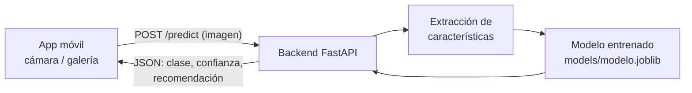

# Diagnóstico de enfermedades en hojas de café

Proyecto del curso **Proyecto I de Innovación Tecnológica en IA** — Maestría en Inteligencia Artificial Aplicada, Universidad Icesi, Cali, Colombia · 2026-2.

#### Estado del proyecto: Activo (Etapa 1 — definición del problema)

## Equipo — Grupo 3

| Nombre | Código | Correo | GitHub |
|--------|--------|--------|--------|
| Dora Valencia Martínez | A00427227 | dora.valencia@gmail.com | [@dorivama](https://github.com/dorivama) |
| Camilo Percy Ocampo | A00022952 | camilo.percy@hotmail.com | [@Ing-percy](https://github.com/Ing-percy) |
| Víctor Manuel Hurtado | A00435019 | victorhurtado.personal@gmail.com | [@VictorHurtado](https://github.com/VictorHurtado) |
| Giovanni Jaramillo Bolaños | A00435020 | giiovaanny11@gmail.com | [@giovannyjb](https://github.com/giovannyjb) |

**Profesor:** Milton Orlando Sarria Paja — [@miltonsarria](https://github.com/miltonsarria)

## Introducción y objetivo

La roya y otras enfermedades de la hoja del café reducen la producción y afectan los ingresos de miles de caficultores; identificarlas temprano permite tratar el cultivo a tiempo. Este proyecto construye un sistema que, a partir de la **fotografía de una hoja**, reconoce si está **sana o afectada, y por cuál enfermedad** (roya, minador, phoma, cercospera), usando las técnicas vistas en el primer semestre: extracción de características de imagen (color, textura, representaciones de una red preentrenada), modelos **SVM y de ensamble**, y **agrupamiento no supervisado** para explorar si las enfermedades se separan sin etiquetas.

Además del modelo, el equipo construye un **prototipo funcional**: una **app móvil** con la que el caficultor fotografía la hoja y recibe el diagnóstico, respaldada por un **backend (API)** que sirve el modelo.

> El árbol de problemas, el planteamiento formal y los objetivos SMART del proyecto están en [`docs/`](docs/README.md) y son la base de la Entrega 1.

## Datos

| Dataset | Variedad | Imágenes | Clases | Fuente |
|---------|----------|---------:|--------|--------|
| **BRACOL** | Arábica | 1.747 | sana · minador · roya · phoma · cercospora (+ severidad) | [Mendeley Data](https://data.mendeley.com/datasets/yy2k5y8mxg/1) |
| **RoCoLe** | Robusta | 1.560 | sana · roya (+ severidad) | [Mendeley Data](https://data.mendeley.com/datasets/c5yvn32dzg/2) · [artículo](https://pmc.ncbi.nlm.nih.gov/articles/PMC6727496/) |

Fotos tomadas con teléfonos móviles en cultivos reales. Los datos **no se versionan** en este repo; instrucciones de descarga y estructura esperada en [`docs/datos.md`](docs/datos.md).

## Métodos y tecnologías

**Metodología:** CRISP-DM (comprensión del negocio → datos → preparación → modelado → evaluación → despliegue).

**Métodos:** extracción de características (histogramas de color, textura LBP/GLCM, *embeddings* de CNN preentrenada) · clasificación con SVM, Random Forest, Gradient Boosting/XGBoost, *stacking* · K-Means / jerárquico + PCA para exploración · validación cruzada estratificada · métricas por clase (precision, recall, F1, matriz de confusión) · análisis de generalización **entre variedades** (entrenar en arábica → probar en robusta) y sensibilidad a fondo e iluminación.

**Tecnologías:** Python 3.12 · pandas, NumPy, scikit-learn, OpenCV/Pillow, scikit-image · PyTorch o TensorFlow (solo como extractor de características) · Jupyter · **FastAPI** (backend) · **Expo / React Native** o **Flutter** (app móvil, por decidir) · Docker (despliegue, opcional) · GitHub.

## Arquitectura del prototipo



Detalle de componentes, contrato de la API y decisiones pendientes: [`docs/arquitectura.md`](docs/arquitectura.md) · [`docs/api.md`](docs/api.md).

## Estructura del repositorio

Sigue la [estructura sugerida por el curso](https://github.com/miltonsarria/ETLInfrati/blob/main/estructura_proyecto.md), ampliada con `backend/`, `mobile/` y `entregas/`.

```
diagnostico-hojas-cafe/
├── docs/            # Árbol de problemas, planteamiento, objetivos, literatura, arquitectura, API, datos, instalación
├── data/            # raw/ y processed/ (no versionados) — ver docs/datos.md
├── notebooks/       # Experimentación: EDA, características, modelos (numerados)
├── src/             # Código fuente reutilizable
│   ├── data/        #   carga y preprocesamiento de imágenes
│   ├── features/    #   extracción de características
│   ├── models/      #   definición de modelos / pipelines
│   ├── training/    #   entrenamiento
│   ├── evaluation/  #   métricas y validación
│   └── utils/       #   utilidades
├── experiments/     # logs/, checkpoints/, results/ (métricas, gráficas)
├── models/          # Artefactos exportados que consume el backend (no versionados)
├── tests/           # Pruebas
├── backend/         # API FastAPI que sirve el modelo
├── mobile/          # App móvil (prototipo)
├── entregas/        # Índice y documentos de cada entrega (1, 2, 3)
├── requirements.txt
└── README.md
```

## Cómo empezar

```bash
git clone https://github.com/giovannyjb/diagnostico-hojas-cafe.git
cd diagnostico-hojas-cafe
python3 -m venv .venv && source .venv/bin/activate   # Windows: .venv\Scripts\activate
pip install -r requirements.txt
```

- Datos: seguir [`docs/datos.md`](docs/datos.md) (descarga manual desde Mendeley a `data/raw/`).
- Backend: ver [`backend/README.md`](backend/README.md) (`uvicorn app.main:app --reload` desde `backend/`).
- App móvil: ver [`mobile/README.md`](mobile/README.md).
- Guía completa: [`docs/instalacion.md`](docs/instalacion.md).

## Entregas y evaluación

| Entrega | Contenido (según programa) | % | Carpeta | Tag |
|---------|---------------------------|--:|---------|-----|
| 1 | Reporte de la primera etapa: problema, árbol, objetivos, literatura, plan, datos | 20% | [`entregas/entrega-1/`](entregas/entrega-1/README.md) | `entrega-1` |
| 2 | Reporte de la segunda etapa: extracción, EDA, preprocesamiento | 10% | [`entregas/entrega-2/`](entregas/entrega-2/README.md) | `entrega-2` |
| 3 | Reporte final + sustentación grupal + coevaluación: modelos, prototipo, conclusiones | 70% | [`entregas/entrega-3/`](entregas/entrega-3/README.md) | `entrega-3` |

Fechas y rúbricas: Intu → *Entregables, Rúbricas*. Cada entrega se congela con un *tag* de git para que el estado revisado quede fijo.

## Notebooks y entregables destacados

- **Análisis del problema** — árbol de problemas y árbol de objetivos: [Markdown](docs/01-arbol-de-problemas.md) · [Figma](https://www.figma.com/board/5qvbH0mT237Vze4YITAsj2/Analisis-del-problema-de-Cafe?node-id=0-1&p=f&t=fQaPk5Am9vy8Gz0O-0) · [PDF](docs/analisis-del-problema-cafe.pdf)
- _(próximos: planteamiento, objetivos SMART, revisión de literatura, EDA, modelos, demo del prototipo)_

## Cómo trabajamos

- Rama `main` estable; una rama por tarea (`feat/eda-bracol`, `docs/arbol-problemas`) y *pull request* con revisión de otro integrante.
- Commits pequeños, en imperativo: `Agrega histograma HSV como característica`.
- Nada de datos ni modelos pesados en git (ver `.gitignore`); nada de credenciales (usar `.env`).
- Los documentos de las entregas se escriben primero en Markdown en `docs/` y luego se pasan a la plantilla Word del curso.

## Licencia

[MIT](LICENSE). Los datasets conservan las licencias indicadas por sus autores en Mendeley Data.
