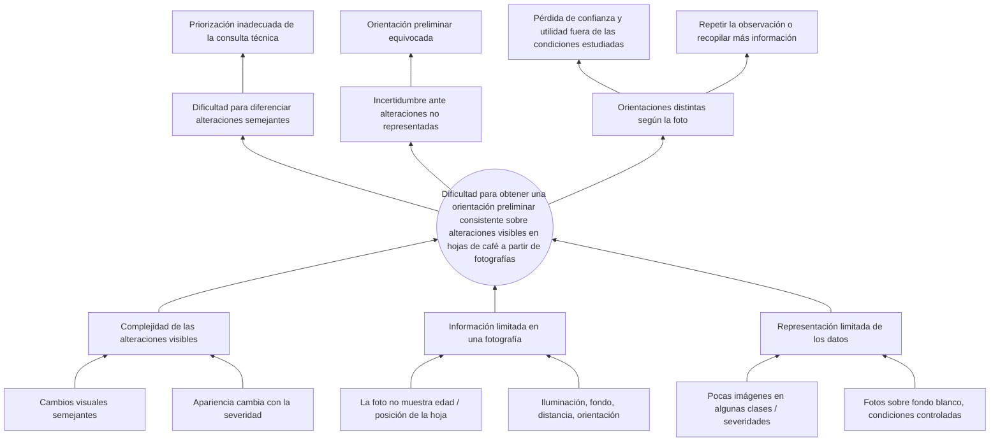
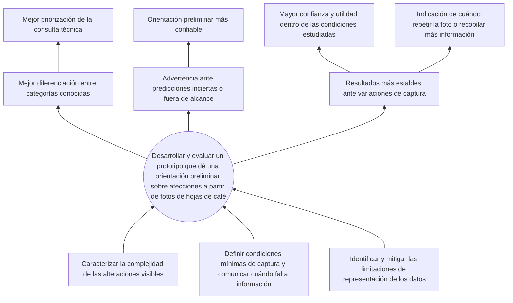

# Árbol de problemas y árbol de objetivos

**Versión visual (fuente):** [tablero en Figma](https://www.figma.com/board/5qvbH0mT237Vze4YITAsj2/Analisis-del-problema-de-Cafe?node-id=0-1&p=f&t=fQaPk5Am9vy8Gz0O-0) · [exportación en PDF](analisis-del-problema-cafe.pdf) (por si no se abre Figma).

Elaborado por el Grupo 3 — Etapa 1 (Sesión 1). Transcripción fiel del tablero.

---

## Árbol de problemas

### Problema central

**Dificultad para obtener una orientación preliminar consistente sobre alteraciones visibles en hojas de café a partir de fotografías.**

### Causas y subcausas

| Causa | Subcausas |
|-------|-----------|
| **1. Complejidad de las alteraciones visibles** | Algunas enfermedades, plagas y deficiencias pueden producir cambios visuales semejantes. · La apariencia cambia con el nivel de severidad. |
| **2. Información limitada en una fotografía** | La imagen de una hoja no siempre muestra la edad o posición de la hoja en la planta. · Iluminación, fondo, distancia y orientación modifican la apariencia. |
| **3. Representación limitada de los datos** | Algunas clases o niveles de severidad podrían tener pocas imágenes. · Las fotografías se tomaron sobre fondo blanco y en condiciones parcialmente controladas. |

### Efectos

1. Dificultad para diferenciar alteraciones visualmente semejantes.
2. Incertidumbre ante alteraciones que no están representadas en las referencias disponibles.
3. Orientaciones diferentes según las condiciones de la fotografía.

### Consecuencias (efectos de segundo nivel)

- Priorización inadecuada de la consulta técnica.
- Orientación preliminar equivocada.
- Pérdida de confianza y utilidad del prototipo fuera de las condiciones estudiadas.
- Necesidad de repetir la observación o recopilar información adicional.

---

## Árbol de objetivos

### Objetivo central

**Desarrollar y evaluar un prototipo que proporcione una orientación preliminar sobre las afecciones presentadas a partir de fotografías de hojas de café.**

### Medios (↔ causas)

1. Caracterizar la complejidad de las alteraciones visibles.
2. Definir condiciones mínimas de captura y comunicar cuándo se requiere información adicional.
3. Identificar y mitigar las limitaciones de representación de los datos.

### Resultados (↔ efectos)

1. Mejor diferenciación entre las categorías conocidas.
2. Advertencia ante predicciones inciertas o fuera del alcance.
3. Resultados más estables ante variaciones de captura.

### Resultados indirectos (↔ consecuencias)

- Mejor priorización de la consulta técnica.
- Orientación preliminar más confiable.
- Mayor confianza y utilidad del prototipo dentro de las condiciones estudiadas.
- Indicación de cuándo repetir la fotografía o recopilar información adicional.

---

## Puntos de intervención

| Causa | ¿La ataca el proyecto? | Cómo (medio) |
|-------|------------------------|--------------|
| Complejidad de las alteraciones visibles | Sí | Características de color/textura/embeddings + modelos SVM/ensambles; análisis por severidad |
| Información limitada en una fotografía | Parcial | Guía de captura en la app; umbral de confianza y aviso de "fuera de alcance" |
| Representación limitada de los datos | Parcial | Balanceo / *augmentation*; evaluación entre variedades (BRACOL ↔ RoCoLe); fotos propias de validación |

## Pendientes para el planteamiento (Entrega 1)

- Datos de apoyo con cifras y fuentes (pérdidas por roya, acceso a asistencia técnica) → [planteamiento](02-planteamiento-del-problema.md).
- Conectar el problema técnico con el problema del caficultor (detección tardía → pérdidas) en la introducción.
- Convertir los medios en objetivos específicos **SMART** → [objetivos](03-objetivos.md).
