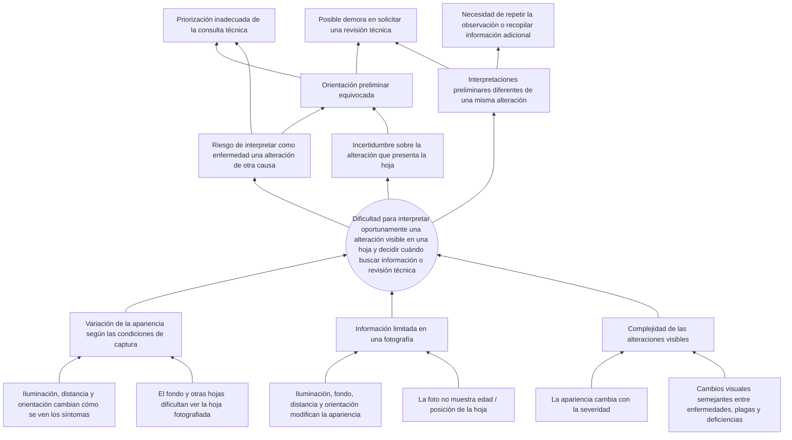
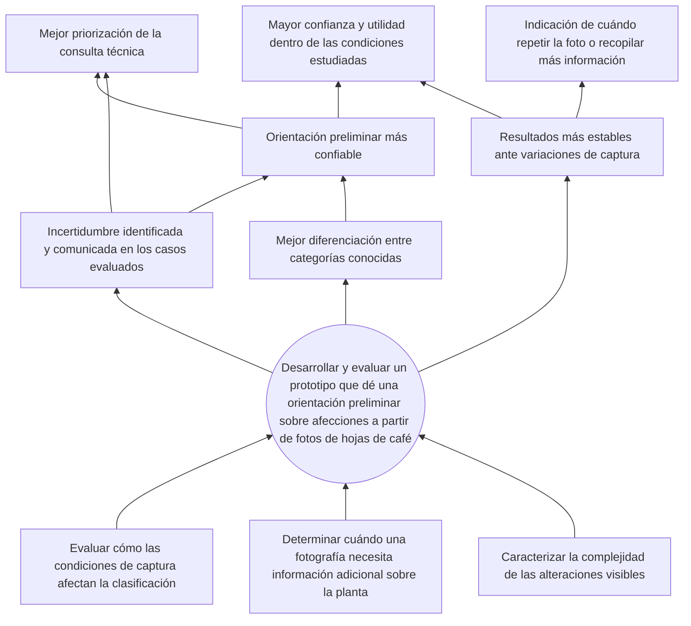

# Árbol de problemas y árbol de objetivos

**Versión visual (fuente):** [tablero en Figma](https://www.figma.com/board/5qvbH0mT237Vze4YITAsj2/Analisis-del-problema-de-Cafe?node-id=0-1&p=f&t=fQaPk5Am9vy8Gz0O-0) · [exportación en PDF](analisis-del-problema-cafe.pdf) (por si no se abre Figma).

Elaborado por el Grupo 3 — Etapa 1. **Versión 2 (2026-10-07)**, revisada tras la primera retroalimentación (ver [cambios](#cambios-v1--v2) al final). Transcripción fiel del tablero.

---

## Árbol de problemas

### Problema central

**Dificultad para interpretar oportunamente una alteración visible en una hoja y decidir cuándo buscar información o revisión técnica.**

### Causas y subcausas

| Causa | Subcausas |
|-------|-----------|
| **1. Complejidad de las alteraciones visibles** | Algunas enfermedades, plagas y deficiencias pueden producir cambios visuales semejantes. · La apariencia cambia con el nivel de severidad. |
| **2. Información limitada en una fotografía** | La imagen de una hoja no siempre muestra la edad o posición de la hoja en la planta. · Iluminación, fondo, distancia y orientación modifican la apariencia. |
| **3. Variación de la apariencia de la hoja según las condiciones de captura** | El fondo y otras hojas pueden dificultar la observación de la hoja fotografiada. · La iluminación, distancia y orientación modifican cómo se ven los síntomas. |

### Efectos

1. Incertidumbre sobre la alteración que presenta la hoja.
2. Riesgo de interpretar como enfermedad una alteración de otra causa.
3. Interpretaciones preliminares diferentes de una misma alteración.

### Consecuencias (dos niveles)

| Nivel | Consecuencia | Viene de |
|-------|--------------|----------|
| 1 | Orientación preliminar equivocada. | efectos 1 y 2 |
| 1 | Necesidad de repetir la observación o recopilar información adicional. | efecto 3 |
| 2 | Priorización inadecuada de la consulta técnica. | efecto 2 · orientación equivocada |
| 2 | Posible demora en solicitar una revisión técnica. | efecto 3 · orientación equivocada |

---

## Árbol de objetivos

### Objetivo central

**Desarrollar y evaluar un prototipo que proporcione una orientación preliminar sobre las afecciones presentadas a partir de fotografías de hojas de café.**

### Medios (↔ causas)

1. Caracterizar la complejidad de las alteraciones visibles.
2. Determinar cuándo una fotografía necesita información adicional sobre la planta.
3. Evaluar cómo las condiciones de captura afectan la clasificación de la hoja.

### Resultados (↔ efectos)

1. Mejor diferenciación entre las categorías conocidas.
2. Incertidumbre identificada y comunicada en los casos evaluados.
3. Resultados más estables ante variaciones de captura.

### Resultados indirectos (↔ consecuencias, dos niveles)

| Nivel | Resultado indirecto | Viene de |
|-------|---------------------|----------|
| 1 | Orientación preliminar más confiable. | resultados 1 y 2 |
| 1 | Indicación de cuándo repetir la fotografía o recopilar información adicional. | resultado 3 |
| 2 | Mejor priorización de la consulta técnica. | resultado 2 · orientación más confiable |
| 2 | Mayor confianza y utilidad del prototipo dentro de las condiciones estudiadas. | resultado 3 · orientación más confiable |

---

## Puntos de intervención

| Causa | ¿La ataca el proyecto? | Cómo (medio) |
|-------|------------------------|--------------|
| Complejidad de las alteraciones visibles | Sí | Características de color/textura/embeddings + modelos SVM/ensambles; análisis por clase y por severidad |
| Información limitada en una fotografía | Parcial | Umbral de confianza y aviso de "falta información / fuera de alcance"; guía de qué fotografiar |
| Variación de la apariencia según las condiciones de captura | Parcial | Evaluar el modelo con variaciones de iluminación, fondo y distancia (*augmentation* y fotos propias); recomendar condiciones de captura |

> Las limitaciones de los datasets (pocas imágenes en algunas clases, fotos sobre fondo blanco) salieron del árbol en la v2: no son causa del problema del caficultor sino un **riesgo del proyecto**. Quedan registradas en [arquitectura.md](arquitectura.md) (riesgos) y en [datos.md](datos.md).

## Cambios v1 → v2

Qué cambió después de la primera revisión y qué recomendación atendió:

| Recomendación | Cambio en la v2 |
|---------------|-----------------|
| Plantear el problema desde quien lo sufre, no desde la dificultad del modelo | El problema central pasó de "dificultad para obtener una orientación preliminar consistente…" a **"dificultad para interpretar oportunamente una alteración… y decidir cuándo buscar información o revisión técnica"**: ahora es una decisión de la persona, con la dimensión de tiempo ("oportunamente"). |
| Los efectos no deben repetir las causas | Los tres efectos ahora son consecuencias para la persona (incertidumbre, interpretar mal, interpretaciones distintas), no la dificultad técnica reescrita. |
| Efectos con consecuencias reales | Se agregó **"posible demora en solicitar una revisión técnica"** (primer paso hacia "detección tardía") y las consecuencias quedaron encadenadas en dos niveles con flechas explícitas. |
| Sacar del árbol lo que no es causa del problema | "Representación limitada de los datos" se reemplazó por "variación de la apariencia según las condiciones de captura"; el medio correspondiente pasó a "evaluar cómo las condiciones de captura afectan la clasificación". |
| Resultados verificables | "Advertencia ante predicciones inciertas" → **"incertidumbre identificada y comunicada en los casos evaluados"**, que ya sugiere cómo verificarlo. |

## Pendientes (para el planteamiento y los objetivos de la Entrega 1)

- **Subcausa repetida:** "Iluminación, fondo, distancia y orientación modifican la apariencia" (causa 2) dice casi lo mismo que la segunda subcausa de la causa 3. Moverla a la causa 3 y dejar en la causa 2 solo lo que la foto *no muestra* (edad/posición de la hoja, envés, estado del resto de la planta, historial del lote).
- **Último eslabón:** falta la consecuencia final que justifica el proyecto: revisión tardía → tratamiento tardío o equivocado → pérdidas de producción/ingresos. Un solo recuadro más arriba de "posible demora…", con su espejo "intervención a tiempo" en el árbol de objetivos.
- **Espejo incompleto:** "posible demora en solicitar una revisión técnica" no tiene espejo exacto; el resultado indirecto podría ser "consulta técnica solicitada a tiempo".
- **Datos de apoyo** con cifras y fuentes (incidencia de roya y otras afecciones, pérdidas, cobertura de asistencia técnica) → [planteamiento](02-planteamiento-del-problema.md).
- **Objetivos SMART:** el objetivo central y los medios siguen sin métrica, alcance (qué afecciones, qué datasets) ni plazo → [objetivos](03-objetivos.md).
