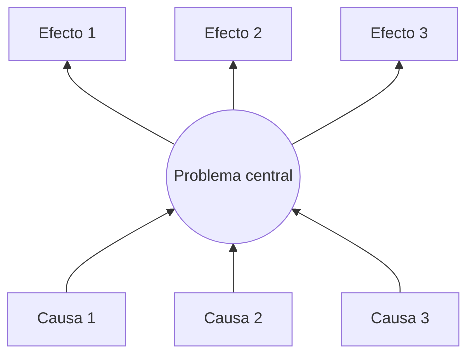

# Árbol de problemas

> Herramienta para descomponer el problema en **causas** (raíces) y **efectos** (ramas). Sirve para elegir dónde interviene la solución de IA. Guía de la Sesión 1: *problema principal → causas y subcausas → efectos → puntos de intervención*.

## Problema central

_(Una sola frase, en negativo, sin incluir la solución. Ej.: "Los caficultores detectan tarde las enfermedades foliares del café".)_

## Causas (¿por qué ocurre?)

Causa 1: …
- Subcausa 1.1: …
- Subcausa 1.2: …

Causa 2: …
- Subcausa 2.1: …

Causa 3: …

## Efectos (¿qué provoca?)

Efecto 1: …
- Efecto derivado 1.1: …

Efecto 2: …

Efecto 3: …

## Diagrama

## Puntos de intervención

¿Qué causas puede atacar razonablemente un sistema de reconocimiento de imágenes en un teléfono? ¿Cuáles **no** (y quedan fuera del alcance)?

| Causa | ¿La ataca el proyecto? | Cómo |
|-------|------------------------|------|
| … | Sí / No / Parcial | … |

## Fuentes de apoyo

_(Cifras de producción, pérdidas por roya, acceso a asistencia técnica, etc. Citar: FNC, Cenicafé, FAO, artículos.)_
