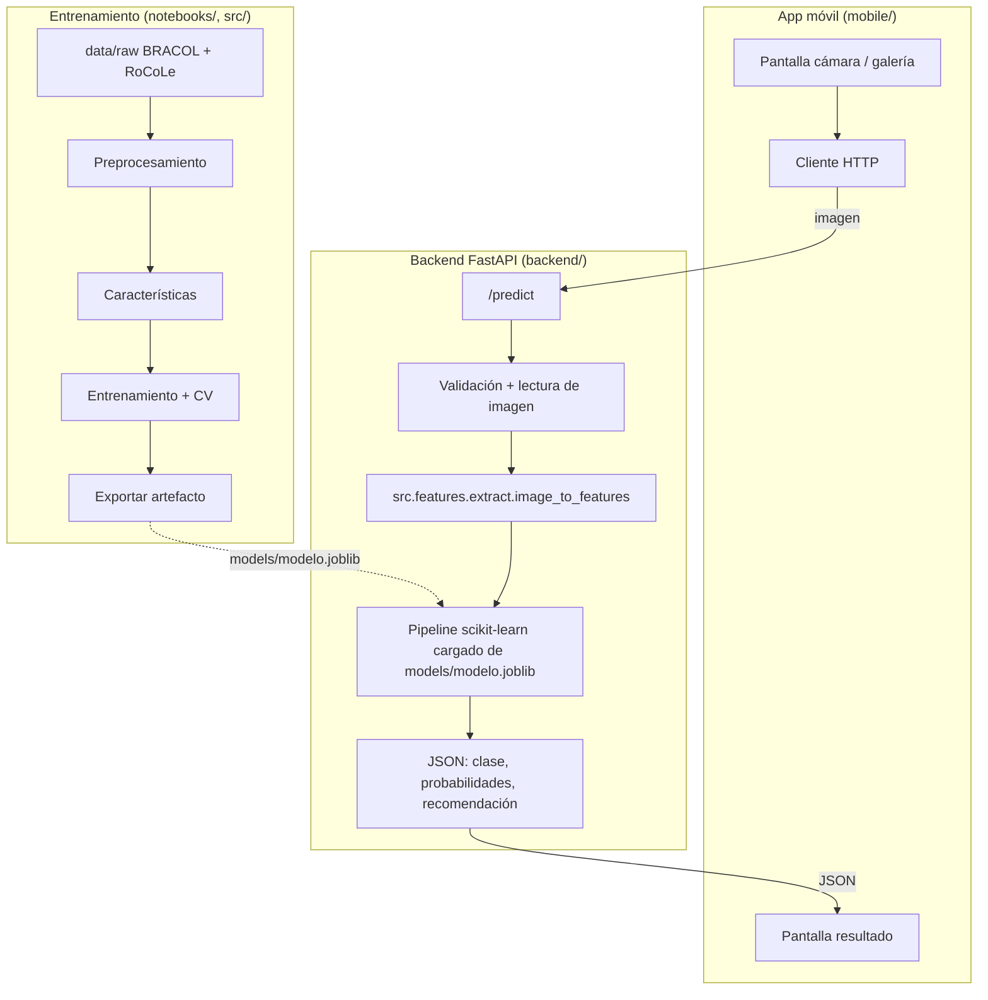

# Arquitectura del prototipo

## Visión

El caficultor toma una foto de la hoja con el teléfono; la app la envía al backend; el backend extrae características, consulta el modelo y devuelve el diagnóstico con su confianza y una recomendación básica. El modelo se entrena y evalúa en este repositorio (`src/`, `notebooks/`) y se exporta como un artefacto que el backend carga al arrancar.



## Componentes

| Componente | Carpeta | Tecnología | Responsabilidad |
|------------|---------|------------|-----------------|
| Datos y EDA | `data/`, `notebooks/` | pandas, Pillow/OpenCV | Entender clases, severidad, calidad de las fotos |
| Características | `src/features/` | NumPy, scikit-image, (torch/tf opcional) | Convertir una imagen en un vector: color, textura, *embeddings* |
| Modelos | `src/models/`, `src/training/`, `src/evaluation/` | scikit-learn, XGBoost | Pipelines SVM / ensambles, CV, métricas, selección |
| Artefacto | `models/modelo.joblib` | joblib | Pipeline entrenado + metadatos (clases, tamaño de imagen, versión) |
| Backend | `backend/` | FastAPI + Uvicorn | Servir `/health` y `/predict`; **la misma función de características que en entrenamiento** |
| App móvil | `mobile/` | Expo/React Native **o** Flutter (por decidir) | Capturar foto, llamar API, mostrar resultado |

## Contrato del artefacto del modelo

`models/modelo.joblib` es un `dict`:

```python
{
    "pipeline": sklearn.pipeline.Pipeline,   # recibe el vector de image_to_features
    "classes": ["sana", "roya", "minador", "phoma", "cercospora"],
    "image_size": [128, 128],                # tamaño al que se redimensiona antes de extraer
    "features_version": "hsv-hist-v1",       # debe coincidir con src/features/extract.py
    "trained_at": "2026-..", "dataset": "bracol", "cv_f1_macro": 0.0
}
```

Regla de oro: **entrenamiento y backend usan la misma función** `image_to_features` con los mismos parámetros; por eso vive en `src/` y no se duplica en `backend/`.

## Decisiones

| Decisión | Estado | Opciones | Criterio |
|----------|--------|----------|----------|
| Framework móvil | ⏳ | Expo/React Native · Flutter | Experiencia del equipo; Expo permite probar en el teléfono sin compilar (Expo Go) |
| Modelo en el servidor vs. en el dispositivo | Servidor (MVP) | API · TFLite/ONNX on-device | Servidor permite cambiar el modelo sin actualizar la app; on-device es trabajo futuro |
| Extractor de características | ⏳ | color+textura manual · CNN preentrenada (MobileNetV2/ResNet) | Comparar en Entrega 2/3; empezar por el manual (baseline explicable) |
| Despliegue del backend para la demo | ⏳ | laptop en la misma Wi-Fi · Render/Railway/HF Spaces (gratis) · Docker | Demo estable el día de la sustentación |
| Severidad | ⏳ | solo clase · clase + severidad | Depende de la calidad de las etiquetas de severidad |

## Riesgos técnicos

- Fotos de la app muy distintas a las del dataset (fondo, luz, distancia) → bajo desempeño real. Mitigar: *data augmentation*, instrucciones en la app ("fondo claro, hoja completa"), evaluar con fotos propias.
- Desbalance de clases → usar F1 macro y `class_weight`.
- Fuga de información si hojas repetidas caen en train y test → revisar duplicados antes del split.
